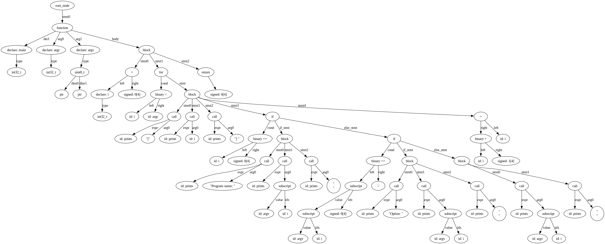

# Проектирование компилятора

Чтобы собрать проект:
```sh
mkdir build && cd build
cmake ..
make
```

Чтобы запустить тесты:
```sh
make all_tests
# или
make
./all_tests
```

Посмотреть покрытие кода:
```sh
make coverage          # формирует gcovr отчёт
make show-coverage     # формирует отчёт и открывает в браузере чрез xdg-open
```

# Синтаксический разбор

Для сборки парсера
```sh
cd build
make parser
```

Пример реализации функции main из задания лабораторной на описанном языке:
```c
int32_t main(int32_t argc, uint8_t **argv) {
    int32_t i = 0;
    for (; i < argc;) {
        prints("[");
        printi(i);
        prints("] ");
        if (i == 0) {
            prints("Program name: ");
            prints(argv[i]);
            prints("\n");
        } else if (argv[i][0] == '-') {
            prints("Option: ");
            prints(argv[i]);
            prints("\n");
        } else {
            prints(argv[i]);
            prints("\n");
        }
        i += 1;
    }
    return 0;
}
```

Полученное в результате синтаксического анализа AST:


Запуск парсера для кода из примера:
```sh
cd build
cat ../tests/frontend/syntax/inputs/lab2.r04 | ./parser && dot -Tpng asd.dot -o syntax_ast.png
xdg-open syntax_ast.png
```
